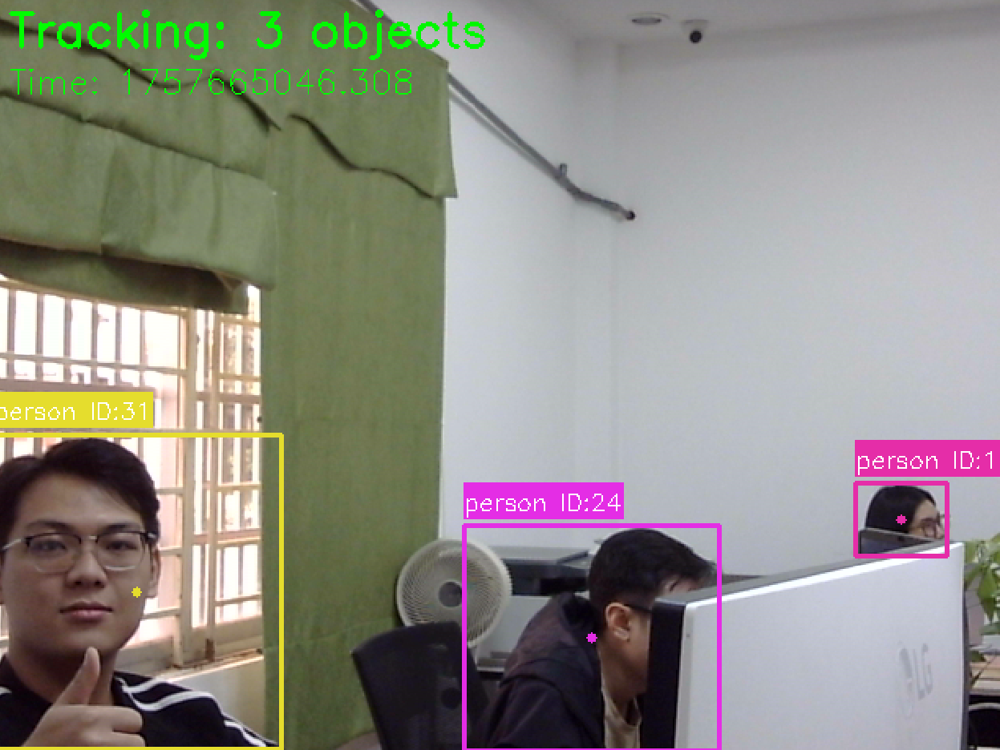

This project implements a camera system, with object detection and object tracking, to recognize human arrival and departure. 
Project contains: 
- YOLOX model for object detection
- ByteTrack for object tracking
- ROS for the communication.
## Requirements
- Python 3.10
- ROS2 Humble
- OpenCV
- Eigen3
- CURL
- TensorRT
- Libfmt9
- ros-humble-rosidl-generator-py 
- ros-humble-rosidl-typesupport-c 
- python3-cv-bridge
- [bbox_ex_msgs](https://github.com/Ar-Ray-code/bbox_ex_msgs)
- [YOLOX-ROS](https://github.com/Ar-Ray-code/YOLOX-ROS)
- [ros_video_player](https://github.com/fateshelled/ros_video_player)
- [bytetrack_ros](https://github.com/fateshelled/bytetrack_ros)

## Setup
1. Clone the repository
2. Download model, and compose engine
```bash
bash src/YOLOX-ROS/weights/tensorrt/convert.bash yolox_s
```
3. Build the project
```bash
colcon build
source install/setup.bash
```
## Usage
To launch the project with ROS2, run the following command:
```bash
ros2 launch bytetrack_ros bytetrack_tensorrt.launch.py
```

## Demo
Human tracking examples:

